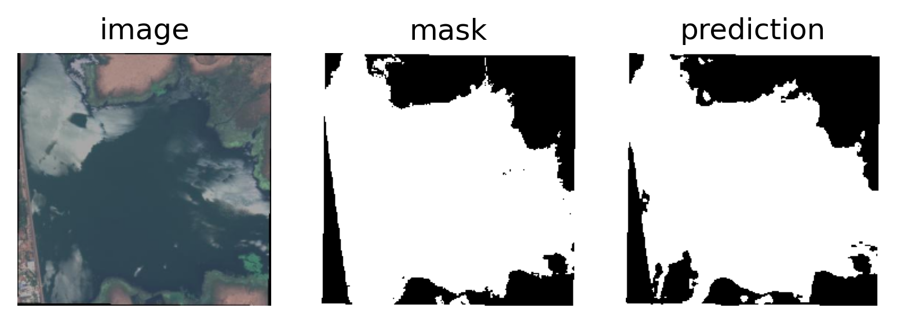

# ml_template

template for ML projects, including examples of image classification and segmentation tasks using Sentinel-2 datasets

## google colab

see the [notebook](ml_template_notebook.ipynb)

note: ignore the instructions for installation below if you are using the notebook on colab

## installation

```
git clone https://github.com/purnelldj/ml_template.git
cd ml_template
python -m venv .venv
source venv/bin/activate
python -m pip install -e .
```

## download data from command line

I am hosting two compressed datasets on my google drive that can be used for testing model architectures for image classification and segmentation

### dataset 1: waterbodies for semantic segmentation

[This dataset on kaggle](https://www.kaggle.com/datasets/franciscoescobar/satellite-images-of-water-bodies/data) consists of thousands of Sentinel-2 images of waterbodies and corresponding water masks

```
pip install gdown
gdown 1JTLSlcxxCANKs_LKZc0Bx5XBta_3sCDb
unzip waterbodies.zip
mkdir datasets
mv waterbodies datasets/
rm -r waterbodies.zip
```

### dataset 2: EuroSAT for image classification

[The EuroSAT dataset](https://github.com/phelber/eurosat?tab=readme-ov-file) is a collection of 27,000 lebelled Sentinel-2 images. The dataset comes in RGB (3-channel) format or 13 spectral bands. Here is a subset of 5,000 images evenly split between then 10 classes (500 images each)

```
gdown 1ci8-w2Y0Z-hZaO-KyS4cFAiHKwfx4MMO
unzip eurosat_rgb.zip
mv eurosat_rgb datasets/
rm -r eurosat_rgb.zip
```

## usage

The main entry point is in [src/traintest.py](src/traintest.py), you can use it from the command line as follows

### train

```
traintest model=resnet dataset=eurosat_rgb
```
### test

```
traintest model=resnet dataset=eurosat_rgb stage=test ckpt_path=path/to/ckpt.ckpt
```

### change parameters

```
traintest model=resnet dataset=eurosat_rgb model.optimizer.lr=0.001 trainer.max_epochs=10
```

### visualize model output

```
traintest model=unet dataset=waterbodies visualize_modelout=True
```

Example model prediction for run `traintest dataset=waterbodies model=unet trainer.max_epochs=20`



## repository structure

see an overview of the structure [here](struct.txt)

a hierarchy of configuration files is found in [src/conf](src/conf) and the default parameters are stored in [src/conf/main.yaml](src/conf/main.yaml).

## logging

to log to wandb first check that you are logged in

```
wandb login
```
then the config file and results will be uploaded to wandb for every run if `logger.mode=online`, e.g.,

```
traintest model=unet dataset=waterbodies logger.mode=online
```


## adding additional models / datasets

By default, data should be stored in a directory `ml_template/datasets`. If you would like to add a new dataset, you need to add a new data module that inherits from the `BaseDM` class and a new cofig file to instantiate the datamodule.
Similarly, to add a new model to work with [src/traintest.py](src/traintest.py), you need to add a new model class that inherits from the `BaseModel` class and a corresponding config (yaml) file to instantiate the model class.
